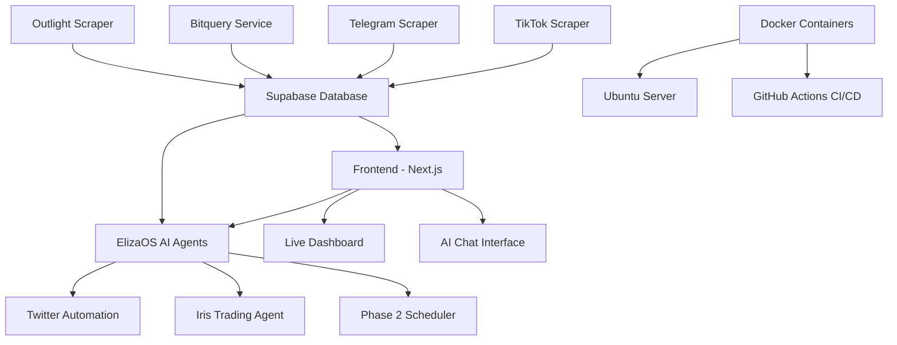

# 🚀 Belisasari - AI-Powered Memecoin Hunting Platform

<div align="center">


**The Ultimate AI-Powered Platform for Discovering and Trading Memecoins**

[](./UBUNTU_DEPLOYMENT_GUIDE.md)
[](./docker-compose.yml)
[](./SUPABASE_SETUP_GUIDE.md)

</div>

---

## 🎯 **What is Belisasari?**

Belisasari is a comprehensive, AI-powered memecoin hunting platform that combines **real-time data collection**, **social media analysis**, and **AI-driven insights** to help traders discover the next big memecoin opportunities. Built with modern web technologies and powered by ElizaOS AI agents.

### 🌟 **Key Features**

- 🔍 **Real-time Data Collection** – TikTok, Twitter, Telegram scraping
- 🤖 **ElizaOS AI Agents** – Iris trading agent, Phase 2 Twitter automation, data-driven recommendations
- 📊 **Live Dashboard** – Real-time market data, TikTok hashtags, Jupiter trending tokens
- 💬 **AI Chat Assistant** – Interactive trading recommendations (OpenAI)
- 🚨 **Smart Alerts** – Price and sentiment notifications
- 📱 **Modern UI** – Next.js, TailwindCSS, ShadCN, Solana wallet integration
- 🐳 **Docker Ready** – Single `.env` for all services; see [Docker env setup](./docs/DOCKER_ENV_SETUP.md)
- 🔐 **Deployment** – GitHub Actions CI/CD; secrets and server env documented in [docs](./docs/GITHUB_DEPLOYMENT_SECRETS.md)

---

## 🏗️ **Architecture Overview**



### 🧩 **Core Components**

| Component | Technology | Purpose |
|-----------|------------|---------|
| **Frontend** | Next.js 14, React, TypeScript, TailwindCSS, ShadCN | Web UI, dashboard, Jupiter/TikTok APIs |
| **AI Agents** | ElizaOS (Iris, Phase 2, Twitter/Content agents) | Market analysis, tweets, recommendations |
| **Data Collection** | Puppeteer (js-scraper), Selenium (scraper) | TikTok, Telegram, Outlight scraping |
| **Database** | Supabase (PostgreSQL) | `tiktoks`, `prices`, tokens, dashboard data |
| **Deployment** | Docker, GitHub Actions | Build images, deploy to server; env via root `.env` or server `.env` |
| **Blockchain** | Solana, Jupiter, Helius | Token data, swap, portfolio |

---

## 🚀 **Quick Start**

### **Prerequisites**

- Node.js 22.x or higher
- Docker and Docker Compose (optional, for containerized run)
- Supabase account
- Git

### **1. Clone the Repository**

```bash
git clone https://github.com/Afoxcute/belisasari.git
cd belisasari
```

### **2. Install Dependencies**

```bash
yarn install
cd frontend && yarn install && cd ..
cd elizaos-agents && yarn install && cd ..
cd js-scraper && yarn install && cd ..
# Optional: bitquery, twitter, scraper (Python)
```

### **3. Environment Setup**

**Important:** Never commit `.env` or `envvars` (they are in `.gitignore`). Use a single env source per environment.

**Option A – Local run (all services via one script)**  
Root `start-belisasari-server.js` loads root `.env` and, if present, `frontend/.env.local`, so Twitter and other keys in `frontend/.env.local` are available to ElizaOS and scrapers.

```bash
# Root .env (required for startup check)
cp .env.docker.example .env
# Edit .env with at least: SUPABASE_URL, SUPABASE_ANON_KEY, OPENAI_API_KEY

# Optional: frontend/.env.local for frontend + shared keys (Twitter, RPC, etc.)
# See frontend/.env.example and docs/ENV_REFERENCE.md
```

**Option B – Docker (single `.env` at repo root)**  
All services use the same root `.env`. See [docs/DOCKER_ENV_SETUP.md](./docs/DOCKER_ENV_SETUP.md).

```bash
cp .env.docker.example .env
# Edit .env with your values (required: SUPABASE_*, OPENAI_API_KEY; recommended: RPC_URL)
docker-compose up -d
```

**Required variables (minimum)**  
| Variable | Description |
|----------|-------------|
| `SUPABASE_URL` | Supabase project URL |
| `SUPABASE_ANON_KEY` or `SUPABASE_ANON_SECRET` | Supabase anon key |
| `OPENAI_API_KEY` | OpenAI API key (chat, agents, scrapers) |

**Recommended**  
- `RPC_URL` or `NEXT_PUBLIC_RPC_URL` – for balance, swap, Jupiter  
- Twitter: `TWITTER_API_KEY`, `TWITTER_API_SECRET`, `TWITTER_ACCESS_TOKEN`, `TWITTER_ACCESS_TOKEN_SECRET` (or `CONSUMER_*` / `ZORO_*`) for posting tweets  

Full list and per-component usage: **[docs/ENV_REFERENCE.md](./docs/ENV_REFERENCE.md)**.

### **4. Database Setup**

Use your Supabase project; ensure tables used by the app (e.g. `tiktoks`, `prices`, tokens) exist. See any Supabase schema docs in the repo (e.g. `complete_supabase_schema.sql` if present).

### **5. Start the Platform**

```bash
# Start all services (frontend, ElizaOS Phase 2, TikTok/Telegram/Outlight scrapers)
yarn belisasari

# Or run individually
yarn dev                    # Frontend only (from repo root)
cd frontend && yarn dev     # Frontend dev server
cd elizaos-agents && node phase2-orchestrator.js   # ElizaOS Phase 2
cd js-scraper && node index.mjs                    # TikTok scraper
```

### **6. Access the Platform**

- **Frontend:** http://localhost:3000  
- **AI Chat:** http://localhost:3000/ai-chat  
- **Dashboard:** http://localhost:3000/dashboard  
- **Follow on X:** [https://x.com/wojat118721](https://x.com/wojat118721) (link in app header)

---

## 📁 **Project Structure**

```
belisasari/
├── frontend/                 # Next.js app (dashboard, Jupiter, TikTok APIs, AI chat)
├── elizaos-agents/           # ElizaOS: Iris agent, Phase 2 orchestrator, Twitter/DB integrations
├── js-scraper/               # TikTok, Telegram, Outlight scrapers (Puppeteer)
├── bitquery/                 # Solana/blockchain data service
├── twitter/                  # Twitter bot utilities
├── scraper/                  # Python TikTok scraper (Selenium)
├── docs/                     # Deployment and env docs
│   ├── DOCKER_ENV_SETUP.md   # Docker env setup (root .env, server .env)
│   ├── GITHUB_DEPLOYMENT_SECRETS.md  # GitHub Actions secrets + server .env
│   └── ENV_REFERENCE.md      # Full env variable reference
├── .github/workflows/        # CI/CD (e.g. deploy.yml)
├── docker-compose.yml        # Frontend, elizaos-agents, js-scraper, optional Redis/Postgres
├── .env.docker.example       # Template for root .env (do not commit .env)
├── start-belisasari-server.js # Orchestrator: loads root .env + frontend/.env.local, starts services
└── README.md
```

---

## 🤖 **AI Agents & ElizaOS Integration**

- **Iris Trading Agent** – Uses Jupiter trending list (`/api/jupiter/tokens/list`), dashboard TikTok hashtags (`/api/dashboard/tiktok-hashtags`), Supabase `tiktoks`/`prices`/trending tokens. Produces data-driven recommendations and can post to Twitter when configured.
- **Phase 2 Orchestrator** – Twitter-only automation: trending alerts, content, market analysis. Uses same Supabase and Twitter env as the rest of the platform.
- **Twitter integration** – Accepts `TWITTER_*` or `CONSUMER_*`/`ZORO_*`; same keys work for frontend post API and ElizaOS. Credentials must be in the env (e.g. root `.env` or `frontend/.env.local` when using `yarn belisasari`).
- **FRONTEND_URL** – Set in production (e.g. `https://your-domain.com`) so agents can call dashboard and Jupiter APIs.

See `elizaos-agents/` and `AGENTS.md` for commands and structure.

---

## 🐳 **Docker Deployment**

- **One `.env`** at the **repo root** is used by all services (frontend, elizaos-agents, js-scraper). Create it from the template: `cp .env.docker.example .env`.
- **Local:** `docker-compose up -d` (uses root `.env`).
- **Server:** Put `.env` on the server (e.g. `/home/ubuntu/belisasari/.env`). The GitHub deploy workflow mounts it into each container as `/app/.env`.
- Full steps and variable list: **[docs/DOCKER_ENV_SETUP.md](./docs/DOCKER_ENV_SETUP.md)**.

---

## 🔐 **GitHub Deployment (CI/CD)**

- **Secrets** (Settings → Secrets and variables → Actions): `DOCKER_USERNAME`, `DOCKER_HUB_ACCESS_TOKEN`, `SSH_HOST`, `SSH_USERNAME`, `SSH_PRIVATE_KEY`. Used to push images and SSH to the server.
- **Application env** is **not** in GitHub; it lives in the server `.env` file. Create/edit it on the server (e.g. `/home/ubuntu/belisasari/.env`) with the same variables as local/Docker.
- Full checklist and optional vars: **[docs/GITHUB_DEPLOYMENT_SECRETS.md](./docs/GITHUB_DEPLOYMENT_SECRETS.md)**.

---

## 📊 **API Endpoints (examples)**

- **Dashboard:** `GET /api/dashboard/tiktok-hashtags`, `GET /api/dashboard/trending-coins`, `GET /api/dashboard/telegram-recent`, etc.
- **Jupiter:** `GET /api/jupiter/tokens/list?list=trending`, swap/order/execute endpoints (when configured).
- **Supabase-backed:** `GET /api/supabase/get-tiktoks`, `GET /api/supabase/get-prices`, and others.
- **AI/Agents:** Decision agent, pattern recognition, real-time events as implemented in the app.

---

## 🔧 **Configuration & Env**

| Variable | Description | Required |
|----------|-------------|----------|
| `SUPABASE_URL` | Supabase project URL | ✅ |
| `SUPABASE_ANON_KEY` or `SUPABASE_ANON_SECRET` | Supabase anon key | ✅ |
| `OPENAI_API_KEY` | OpenAI API key | ✅ |
| `RPC_URL` or `NEXT_PUBLIC_RPC_URL` | Solana RPC (balance, swap, Jupiter) | Recommended |
| `TWITTER_*` or `CONSUMER_*`/`ZORO_*` | Twitter posting (ElizaOS + frontend) | Optional |
| `FRONTEND_URL` | App URL for ElizaOS (e.g. production) | Optional (set in prod) |
| `TELEGRAM_BOT_TOKEN` | Telegram scraper | Optional |
| `JUPITER_ULTRA_API_KEY` / `JUPITER_API_KEY` | Jupiter APIs | Optional |

Full reference: **[docs/ENV_REFERENCE.md](./docs/ENV_REFERENCE.md)**.  
**Security:** Do not commit `.env` or `envvars`; rotate any keys if they were ever committed.

---

## 📚 **Documentation**

| Doc | Description |
|-----|-------------|
| [docs/DOCKER_ENV_SETUP.md](./docs/DOCKER_ENV_SETUP.md) | Docker env: root `.env`, `.env.docker.example`, server deploy |
| [docs/GITHUB_DEPLOYMENT_SECRETS.md](./docs/GITHUB_DEPLOYMENT_SECRETS.md) | GitHub Actions secrets and server `.env` checklist |
| [docs/ENV_REFERENCE.md](./docs/ENV_REFERENCE.md) | Full list of env vars by component |
| [AGENTS.md](./AGENTS.md) | Architecture and commands (frontend, scrapers, agents) |
| [QUICK_START.md](./QUICK_START.md) | Quick start (if present) |
| [UBUNTU_DEPLOYMENT_GUIDE.md](./UBUNTU_DEPLOYMENT_GUIDE.md) | Ubuntu server deployment (if present) |
| [SUPABASE_SETUP_GUIDE.md](./SUPABASE_SETUP_GUIDE.md) | Supabase setup (if present) |

---

## 🛠️ **Development**

### **Scripts (root)**

```bash
yarn belisasari      # Start all services (loads root .env + frontend/.env.local)
yarn dev             # Frontend dev
yarn build           # Install all + frontend build
yarn docker:build   # Build Docker images
yarn docker:up       # docker-compose up -d
yarn docker:down     # docker-compose down
yarn deploy:ubuntu   # Run deploy script (if present)
```

### **Code style**

- TypeScript strict mode, ESLint (Next.js), ShadCN, TailwindCSS  
- Path alias `@/*` → frontend root  
- Env for all secrets; no `.env` or `envvars` in version control  

---

## 🐛 **Troubleshooting**

- **Twitter not posting** – Ensure Twitter env vars are in the env seen by the process (root `.env` or `frontend/.env.local` when using `yarn belisasari`). See [earlier fix summary](./elizaos-agents/TWITTER_INTEGRATION_FIX.md) if present.
- **Push blocked (secrets)** – Do not commit `.env` or `envvars`. If a secret was pushed, remove it from history and rotate the key. See GitHub’s [push protection](https://docs.github.com/code-security/secret-scanning/working-with-secret-scanning-and-push-protection/working-with-push-protection-from-the-command-line#resolving-a-blocked-push).
- **Docker/build** – Use root `.env` from `.env.docker.example`; see [docs/DOCKER_ENV_SETUP.md](./docs/DOCKER_ENV_SETUP.md).
- **Supabase** – Verify `SUPABASE_URL` and `SUPABASE_ANON_KEY` (or `SUPABASE_ANON_SECRET`).

---

## 📄 **License**

This project is licensed under the MIT License - see the [LICENSE](LICENSE) file for details.

---

## 🙏 **Acknowledgments**

- ElizaOS – AI agent infrastructure  
- Next.js, Supabase, TailwindCSS, ShadCN  
- Solana, Jupiter, Helius  
- twitter-api-v2, Puppeteer  

---

<div align="center">

**Built for the memecoin community**

[Follow on X](https://x.com/wojat118721) · [⭐ Star this repo](https://github.com/Afoxcute/belisasari) · [🐛 Report Bug](https://github.com/Afoxcute/belisasari/issues) · [💡 Request Feature](https://github.com/Afoxcute/belisasari/issues)

</div>
