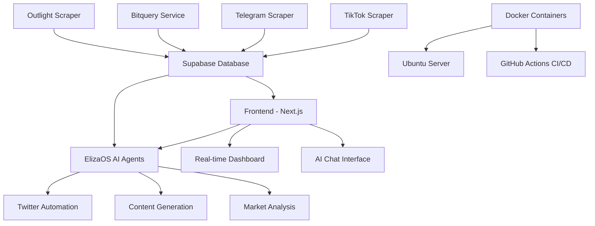

# 🚀 Belisasari - AI-Powered Memecoin Hunting Platform

<div align="center">


**The Ultimate AI-Powered Platform for Discovering and Trading Memecoins**

[](./UBUNTU_DEPLOYMENT_GUIDE.md)
[](./docker-compose.yml)
[](./SUPABASE_SETUP_GUIDE.md)

</div>

---

## 🎯 **What is Belisasari?**

Belisasari is a comprehensive, AI-powered memecoin hunting platform that combines **real-time data collection**, **social media analysis**, and **AI-driven insights** to help traders discover the next big memecoin opportunities. Built with modern web technologies and powered by advanced AI agents.

### 🌟 **Key Features**

- 🔍 **Real-time Data Collection** - TikTok, Twitter, Telegram scraping
- 🤖 **AI-Powered Analysis** - ElizaOS agents for market insights
- 📊 **Live Dashboard** - Real-time market data and trends
- 💬 **AI Chat Assistant** - Interactive trading recommendations
- 🚨 **Smart Alerts** - Price and sentiment notifications
- 📱 **Modern UI** - Built with Next.js and TailwindCSS
- 🐳 **Docker Ready** - Easy deployment and scaling

---

## 🏗️ **Architecture Overview**



### 🧩 **Core Components**

| Component | Technology | Purpose |
|-----------|------------|---------|
| **Frontend** | Next.js 14, React, TypeScript, TailwindCSS | Modern web interface |
| **AI Agents** | ElizaOS Framework | Intelligent market analysis |
| **Data Collection** | Puppeteer, Selenium | Social media scraping |
| **Database** | Supabase (PostgreSQL) | Real-time data storage |
| **Deployment** | Docker, GitHub Actions | Automated deployment |
| **Blockchain** | Solana Web3.js | Token data integration |

---

## 🚀 **Quick Start**

### **Prerequisites**

- Node.js 22.x or higher
- Docker and Docker Compose
- Supabase account
- Git

### **1. Clone the Repository**

```bash
git clone https://github.com/your-username/belisasari.git
cd belisasari
```

### **2. Install Dependencies**

```bash
# Install root dependencies
yarn install

# Install frontend dependencies
cd frontend && yarn install && cd ..

# Install ElizaOS agents dependencies
cd elizaos-agents && yarn install && cd ..

# Install Bitquery service dependencies
cd bitquery && yarn install && cd ..

# Install JS scraper dependencies
cd js-scraper && yarn install && cd ..
```

### **3. Environment Setup**

```bash
# Copy environment template
cp env.example .env

# Edit environment variables
nano .env
```

**Required Environment Variables:**
```env
# Supabase Configuration
SUPABASE_URL=your_supabase_url
SUPABASE_ANON_SECRET=your_supabase_anon_secret

# Twitter API
TWITTER_API_KEY=your_twitter_api_key
TWITTER_API_SECRET=your_twitter_api_secret
TWITTER_ACCESS_TOKEN=your_twitter_access_token
TWITTER_ACCESS_TOKEN_SECRET=your_twitter_access_token_secret

# Bitquery API
BITQUERY_API_KEY=your_bitquery_api_key
```

### **4. Database Setup**

```bash
# Run Supabase setup
psql -h your-supabase-host -U postgres -d postgres -f complete_supabase_schema.sql
```

### **5. Start the Platform**

```bash
# Start all services
yarn belisasari

# Or start individual services
yarn start:frontend    # Frontend only
yarn start:agents      # ElizaOS agents only
yarn start:scrapers    # All scrapers
```

### **6. Access the Platform**

- **Frontend**: http://localhost:3000
- **AI Chat**: http://localhost:3000/ai-chat
- **Dashboard**: http://localhost:3000/dashboard

---

## 📁 **Project Structure**

```
belisasari/
├── 📁 frontend/                 # Next.js frontend application
│   ├── 📁 app/                 # App router pages
│   ├── 📁 components/          # React components
│   ├── 📁 lib/                 # Utilities and services
│   └── 📄 package.json
├── 📁 elizaos-agents/          # AI agents (ElizaOS framework)
│   ├── 📁 agents/              # Individual AI agents
│   ├── 📁 integrations/        # External service integrations
│   └── 📄 package.json
├── 📁 bitquery/                # Blockchain data service
│   ├── 📁 scripts/             # Data collection scripts
│   └── 📄 package.json
├── 📁 js-scraper/              # JavaScript scrapers
│   ├── 📄 index.mjs            # TikTok scraper
│   └── 📄 package.json
├── 📁 .github/workflows/       # GitHub Actions CI/CD
├── 📄 docker-compose.yml       # Docker services configuration
├── 📄 start-belisasari-server.js    # Main orchestrator script
└── 📄 README.md                # This file
```

---

## 🤖 **AI Agents & Services**

### **Phase 1: Data Collection & Display**
- **TikTok Scraper** - Collects trending memecoin content
- **Telegram Scraper** - Monitors crypto channels
- **Bitquery Service** - Fetches blockchain data
- **Real-time Dashboard** - Displays live market data

### **Phase 2: Social Media Automation**
- **Twitter Manager Agent** - Automated posting and engagement
- **Content Generator Agent** - Creates memecoin content
- **Master Scheduler Agent** - Coordinates posting schedules

### **Phase 3: AI-Powered Frontend**
- **AI Chat Assistant** - Interactive trading recommendations
- **Personalization Service** - User preference learning
- **Real-time Service** - Live updates and notifications

### **Phase 4: AI Trading & Portfolio Management**
- **Decision Agent** - Automated trading decisions
- **Portfolio Manager** - Risk management and optimization
- **Pattern Recognition** - Market trend analysis

---

## 🐳 **Docker Deployment**

### **Local Development**

```bash
# Build all services
docker-compose build

# Start all services
docker-compose up -d

# View logs
docker-compose logs -f

# Stop services
docker-compose down
```

### **Production Deployment**

```bash
# Deploy to Ubuntu server
chmod +x deploy-ubuntu.sh
./deploy-ubuntu.sh

# Or use GitHub Actions for automated deployment
# Push to main branch triggers deployment
```

---

## 📊 **API Endpoints**

### **Dashboard APIs**
- `GET /api/dashboard/trending-coins` - Trending memecoins
- `GET /api/dashboard/analysis-results` - Market analysis
- `GET /api/dashboard/telegram-recent` - Recent Telegram data
- `GET /api/dashboard/tiktok-hashtags` - TikTok hashtag trends

### **Supabase APIs**
- `GET /api/supabase/get-tiktoks` - TikTok data
- `GET /api/supabase/get-prices` - Price data
- `GET /api/supabase/get-mentions` - Social mentions
- `POST /api/supabase/add-sub` - Add subscription

### **AI Agent APIs**
- `POST /api/decision-agent` - Trading decisions
- `POST /api/pattern-recognition` - Pattern analysis
- `GET /api/real-time/events` - Real-time events

---

## 🔧 **Configuration**

### **Environment Variables**

| Variable | Description | Required |
|----------|-------------|----------|
| `SUPABASE_URL` | Supabase project URL | ✅ |
| `SUPABASE_ANON_SECRET` | Supabase anonymous key | ✅ |
| `TWITTER_API_KEY` | Twitter API key | ✅ |
| `TWITTER_API_SECRET` | Twitter API secret | ✅ |
| `BITQUERY_API_KEY` | Bitquery API key | ✅ |
| `DISCORD_BOT_TOKEN` | Discord bot token | ❌ |
| `TELEGRAM_BOT_TOKEN` | Telegram bot token | ❌ |

### **Service Configuration**

- **Frontend**: Configured via `frontend/next.config.mjs`
- **ElizaOS Agents**: Configured via `elizaos-agents/config/`
- **Docker**: Configured via `docker-compose.yml`
- **CI/CD**: Configured via `.github/workflows/deploy.yml`

---

## 🚀 **Deployment Options**

### **1. Ubuntu Server Deployment**
```bash
# Automated deployment script
./deploy-ubuntu.sh

# Manual deployment
./UBUNTU_DEPLOYMENT_GUIDE.md
```

### **2. Docker Deployment**
```bash
# Local development
docker-compose up -d

# Production
docker-compose -f docker-compose.prod.yml up -d
```

### **3. GitHub Actions CI/CD**
- Automatic deployment on push to main branch
- Environment variables via GitHub Secrets
- Docker image building and deployment

---

## 📈 **Monitoring & Analytics**

### **Service Health Checks**
- **Frontend**: `http://localhost:3000/api/health`
- **ElizaOS Agents**: Built-in health monitoring
- **Scrapers**: Log-based monitoring
- **Database**: Supabase dashboard

### **Logs & Debugging**
```bash
# View all service logs
docker-compose logs -f

# View specific service logs
docker-compose logs -f frontend
docker-compose logs -f elizaos-agents
docker-compose logs -f bitquery
docker-compose logs -f js-scraper

# View scraper logs
docker-compose exec js-scraper cat /var/log/scraper-cron.log
docker-compose exec bitquery cat /var/log/bitquery-cron.log
```

---

## 🛠️ **Development**

### **Available Scripts**

```bash
# Root level
yarn belisasari              # Start all services
yarn start:all          # Alternative start command
yarn docker:build       # Build Docker images
yarn docker:up          # Start Docker services
yarn docker:down        # Stop Docker services

# Frontend
cd frontend
yarn dev                # Development server
yarn build              # Production build
yarn start              # Production server
yarn lint               # ESLint

# ElizaOS Agents
cd elizaos-agents
yarn start              # Start agents
yarn test               # Run tests

# Bitquery Service
cd bitquery
yarn start              # Start service
node index.mjs          # Run data collection

# JS Scraper
cd js-scraper
yarn scrape-tiktok      # TikTok scraper
yarn scrape-telegram    # Telegram scraper
yarn scrape-outlight    # Outlight scraper
```

### **Code Style**
- **TypeScript** - Strict mode enabled
- **ESLint** - Next.js configuration
- **Prettier** - Code formatting
- **TailwindCSS** - Utility-first CSS

---

## 🤝 **Contributing**

1. **Fork the repository**
2. **Create a feature branch**: `git checkout -b feature/amazing-feature`
3. **Commit changes**: `git commit -m 'Add amazing feature'`
4. **Push to branch**: `git push origin feature/amazing-feature`
5. **Open a Pull Request**

### **Development Guidelines**
- Follow TypeScript best practices
- Write comprehensive tests
- Update documentation
- Follow the existing code style

---

## 📚 **Documentation**

- **[Quick Start Guide](./QUICK_START.md)** - Get up and running quickly
- **[Ubuntu Deployment Guide](./UBUNTU_DEPLOYMENT_GUIDE.md)** - Server deployment
- **[Supabase Setup Guide](./SUPABASE_SETUP_GUIDE.md)** - Database configuration
- **[Docker Troubleshooting](./DOCKER_TROUBLESHOOTING.md)** - Common issues
- **[ElizaOS Agents Guide](./elizaos-agents/README.md)** - AI agents documentation

---

## 🐛 **Troubleshooting**

### **Common Issues**

1. **WebSocket Connection Errors**
   - Solution: AI chat uses simulated data by default
   - See: [AI Chat WebSocket Fix](./AI_CHAT_WEBSOCKET_FIX.md)

2. **Docker Build Failures**
   - Solution: Use `--legacy-peer-deps` flag
   - See: [Docker Build Fix](./DOCKER_BUILD_COMPLETE_FIX.md)

3. **TypeScript Errors**
   - Solution: Ensure Node.js 22.x is installed
   - See: [Node Version Fix](./NODE_VERSION_FIX.md)

4. **Supabase Connection Issues**
   - Solution: Verify environment variables
   - See: [Supabase Setup Guide](./SUPABASE_SETUP_GUIDE.md)

### **Getting Help**

- 📖 **Documentation**: Check the guides in the root directory
- 🐛 **Issues**: Open a GitHub issue
- 💬 **Discussions**: Use GitHub Discussions
- 📧 **Contact**: [Your Contact Information]

---

## 📄 **License**

This project is licensed under the MIT License - see the [LICENSE](LICENSE) file for details.

---

## 🙏 **Acknowledgments**

- **ElizaOS Framework** - AI agent infrastructure
- **Next.js Team** - Modern React framework
- **Supabase** - Backend-as-a-Service
- **TailwindCSS** - Utility-first CSS framework
- **Solana** - Blockchain infrastructure

---

## 📊 **Project Status**


---

<div align="center">

**🚀 Built with ❤️ for the memecoin community**

[⭐ Star this repo](https://github.com/your-username/belisasari) | [🐛 Report Bug](https://github.com/your-username/belisasari/issues) | [💡 Request Feature](https://github.com/your-username/belisasari/issues)

</div>
